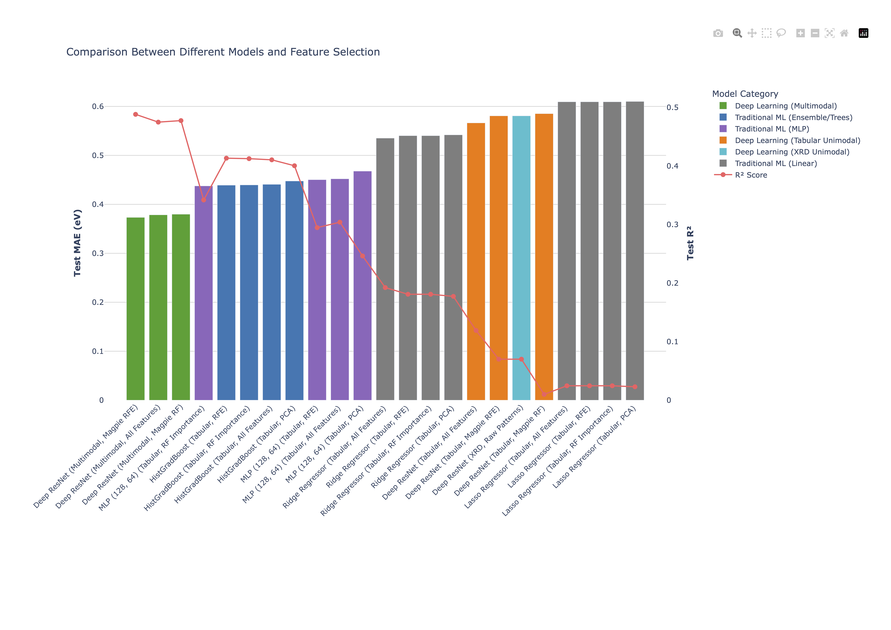

# Multimodal Deep Learning for Bandgap Prediction in Crystalline Materials

## Introduction

Bandgap engineering lies at the heart of modern semiconductor design, optoelectronics, and clean energy technologies. While first-principles methods like Density Functional Theory (DFT) provide high-accuracy bandgap calculations, their enormous computational cost severely bottlenecks high-throughput materials discovery.

This project introduces a comprehensive, automated machine learning pipeline to rapidly predict the bandgap of crystalline materials. Instead of relying solely on compositional data, this repository explores a multimodal approach by ccombining simulated 1D X-Ray Diffraction (XRD) patterns to capture global structural geometry with a robust tabular dataset of 104 engineered features. This tabular data fuses 90 elemental Magpie statistics (capturing chemical and electronic properties) with 3 symmetry features, 1 volume per atom metric, and 10 CrystalNN geometric descriptors (capturing local structural context).

By benchmarking traditional Scikit-Learn tabular models against a custom, multi-branch PyTorch ResNet architecture, this project aims to determine whether integrating structural modalities via deep learning yields a statistically significant improvement in bandgap prediction over pure compositional baselines.

## Data Acquisition & Feature Engineering

All data is dynamically acquired and processed; no raw datasets are stored in this repository. The extraction script (`notebooks/01_data_extraction.ipynb`) performs the following:

1. **API Querying:** Fetches crystal structures (CIF files) and target bandgaps from the Materials Project via `mp-api`. Filters applied for non-metallic crystalline structures containing 1 to 6 unique elements with bandgaps between 0.5 eV and 3.0 eV.

2. **Structural Modality (1D XRD):** Using `pymatgen`, we simulated $Cu-K\alpha$ X-Ray Diffraction patterns. To enable neural network processing, these patterns were mapped to a continuous 1D grid ($2\theta \in [10^\circ, 80^\circ]$ with a 0.02° resolution) and broadened using a Gaussian kernel (FWHM = 0.02°). The arrays were normalized to a maximum intensity of 1.0.

3. **Tabular Modality:** We extracted 90 elemental statistics (e.g., mean, standard deviation, range of electronegativity, and atomic radii) using the `matminer` Magpie featurizer. Furthermore, we calculated 14 structural metrics, explicitly including 3 symmetry features, 1 volume per atom feature, and 10 geometrical descriptors via  `CrystalNN`.

4. **Preprocessing:** The dataset was divided into an 80/10/10 train/validation/test split, stratified by the target bandgap distribution. All tabular features were standardized using a `StandardScaler` fitted exclusively on the training set to prevent data leakage.

---

## Installation & Setup

**1. Clone and Create Environment**
To ensure perfect reproducibility, please use Python 3.10+ and install the strict dependencies:


```bash
git clone https://github.com/yunchimaxwelllo/Bandgap-Predictor.git
cd Bandgap-Predictor
python -m venv .venv
source .venv/bin/activate  # On Windows use: .venv\Scripts\activate 
pip install -r requirements.txt
```


**2. Materials Project API Key**
You must provide an API key to download the structural data. Create a file named `.env` in the root directory and add your key in this format: 

```text
MP_API_KEY=YOUR_API_KEY
```

---

### Executing the Pipeline

The entire workflow is centrally managed by the `main.py` script. This script acts as a router, using the `--mode` argument to execute specific Jupyter Notebooks headlessly via `nbconvert`. This design ensures that the code running in the background is identical to the human-readable notebooks provided in the repository.

### Execution Environments: Local vs. Server

Depending on your hardware, you must choose the appropriate way to run these scripts:

**1. Local Machine (Standard Execution)**
    
 If you are running this repository on a powerful local workstation, or if you are only running the lightweight visualization steps, you can execute the commands directly in your terminal. 
* *Warning:* If you use this method, you must leave the terminal open. Closing the window or putting your computer to sleep will instantly kill the process.
    
Type this in the terminal: 

```bash
python main.py --mode <mode>
```


**2. Remote Server / Cluster (Background Execution)**
    
If you are running this on a remote compute cluster (e.g., via SSH to a SLURM node), it is highly recommended to run the heavy-lifting steps (Data Extraction and Deep Learning) as background jobs using `nohup` (no hangup). This ensures the script continues to run even if your SSH connection drops or you close your laptop.

Type this in the terminal: 
```bash
nohup python main.py --mode <mode> > process.log 2>&1 &
```

* **`nohup ... &`**: Detaches the process from your active terminal, allowing it to run safely in the background.
* **`> process.log`**: Captures all terminal outputs, progress bars, and print statements into a text file so you can review them later.
* **`2>&1`**: Ensures that any system errors or crash reports are also caught and saved to that same log file.

*(Tip: You can monitor the live progress of a background job at any time by running: `tail -f process.log`)*

---

### Pipeline Commands

You can execute the entire pipeline end-to-end, or run specific modules individually.

**Option A: Run the Entire Pipeline End-to-End**
*(Note: Full data extraction and deep learning training may take 6-10 hours. A GPU node is highly recommended.)*

    nohup python main.py --mode all > pipeline_output.log 2>&1 &

**Option B: Modular Step-by-Step Execution**
Use this method for debugging, running specific sections on different types of compute nodes (e.g., CPU vs. GPU), or regenerating specific outputs.

* **Step 1: Data Extraction & Feature Engineering**
  *(Downloads CIFs, simulates XRD, and engineers tabular Magpie features. Takes ~1 hour. CPU node is sufficient.)*
  
      nohup python main.py --mode extract > extract.log 2>&1 &

* **Step 2: Deep Learning Ablation**
  *(Trains the PyTorch Unimodal and Multimodal ResNet models. Requires a GPU. Takes ~6-8 hours.)*
  
      nohup python main.py --mode train_dl > dl_train.log 2>&1 &

* **Step 3: Traditional ML Baselines**
  *(Trains Scikit-Learn baseline models utilizing PCA, RFE, and RF Importance. Takes ~15 minutes. Can be run interactively.)*
  
      python main.py --mode train_ml

* **Step 4: Results Visualization**
  *(Generates the dual-axis benchmark charts and HTML plots from the saved .csv results. Takes <1 minute. Can be run interactively.)*
  
      python main.py --mode visualize
---

## Evaluation & Baselines

The pipeline automatically evaluates all models on the held-out test set.

* **Traditional Baselines:** Ridge Regression, Lasso Regression, HistGradientBoosting, and Multi-Layer Perceptrons (MLPs) using only the tabular feature space. Includes an ablation study utilizing three feature reduction techniques: Recursive Feature Elimination (RFE), Principal Component Analysis (PCA), and Random Forest Feature Importance.

* **Deep Learning Training:** Implemented in PyTorch using the AdamW optimizer (learning rate = 2e-4, weight decay = 5e-3) alongside a Huber loss function ($\delta$=0.25) for robust outlier handling. Training is conducted over a maximum of 120 epochs utilizing a Cosine Annealing learning rate scheduler with a 15-epoch warmup period. To stabilize training and improve generalization, the pipeline applies gradient clipping (max norm = 1.0) and maintains an Exponential Moving Average (EMA, decay = 0.995) of the model weights. Early stopping is enforced with a patience of 25 epochs based on improvements in the validation MAE.

* **Outputs:**
    * Quantitative evaluation metrics (MAE, RMSE, R²) for every model state are saved to `results/dl_ablation_results.csv` and `results/ml_baselines_results.csv`.
    * An interactive HTML chart comparing all methodologies is exported to `results/interactive_benchmark.html`. 
    * Random seeds are fixed globally in `src/config.py` to ensure exact reproducibility.

---


## Results and Discussion

The predictive performance across all methodologies demonstrates that combining simulated X-Ray Diffraction (XRD) patterns with tabular elemental descriptors in a multimodal neural network significantly outperforms any single-modality or traditional machine learning approach. The analysis of these results is broken down into three key areas: overall model comparisons, modality ablation, and feature selection optimization.

### 1. Cross-Model Performance Evaluation

When utilizing the full feature set, the Deep Learning (Multimodal) framework achieved the lowest error, followed by Traditional ML (Ensemble/Trees) utilizing HistGradientBoosting, and then the Traditional ML (MLP). The Traditional ML (Linear) models, including Ridge and Lasso regression, yielded the weakest predictive performance. 

This hierarchy directly aligns with the underlying physics of bandgap formation. A material's bandgap is governed by highly non-linear interactions between its stoichiometric composition and its specific crystal lattice geometry. The linear models fail to capture this complexity, whereas tree-based ensembles like HistGradientBoosting excel at modeling non-linear interactions within structured tabular data. However, the Multimodal Deep Learning model ultimately performs best because it is the only architecture capable of simultaneously learning deep representations from both the raw structural geometry (XRD) and the chemical composition (tabular features), mapping their complex interplay in a single latent space.

### 2. Modality Ablation Study

To quantify the contribution of each data type, an ablation study was conducted within the deep learning framework. The multimodal model was compared against unimodal networks trained exclusively on either the tabular descriptors or the 1D XRD patterns.

| Modality Setup | Test MAE (eV) | Test RMSE (eV) | Test R² |
| :--- | :--- | :--- | :--- |
| **Multimodal (Full Tabular + XRD)** | **0.3785** | **0.5188** | **0.4749** |
| Tabular Only (Full Features) | 0.5673 | 0.6720 | 0.1191 |
| XRD Patterns Only | 0.5915 | 0.6985 | 0.0481 |

The multimodal network vastly outperforms either individual modality, indicating that neither input is sufficient to predict the bandgap in isolation. This is physically intuitive: XRD patterns capture crucial geometric information, such as lattice parameters and phase signatures, but lack the direct encoding of elemental electronegativity and atomic radii necessary to calculate electronic contributions. Conversely, tabular Magpie descriptors thoroughly summarize the chemical makeup but fail to preserve the exact spatial arrangement of the atoms. Only by fusing both modalities can the model access the complete structural-chemical profile required for accurate electronic property prediction.

### 3. Feature Selection Optimization

Within the multimodal framework, further optimization was tested by applying feature selection techniques to the tabular branch.

| Feature Selection Method | Test MAE (eV) | Test RMSE (eV) | Test R² |
| :--- | :--- | :--- | :--- |
| **Multimodal (RFE Tabular + XRD)** | **0.3733** | **0.5122** | **0.4882** |
| Multimodal (Full Tabular + XRD) | 0.3785 | 0.5188 | 0.4749 |
| Multimodal (RF Tabular + XRD) | 0.3798 | 0.5175 | 0.4775 |

Recursive Feature Elimination (RFE) provided a slight but distinct improvement over both the full-feature baseline and the Random Forest (RF) importance subset, achieving the lowest overall MAE of 0.3733 eV. This suggests that RFE successfully stripped away redundant or noisy tabular features, isolating only the compositional data that is strictly complementary to the XRD branch. In a fusion architecture, the tabular inputs do not need to explain the entire bandgap variance independently; they only need to provide the chemical context that the diffraction pattern misses. By reducing feature overlap, RFE streamlined the latent space, making the tabular branch easier for the network to optimize during gradient descent.


*(A static preview of the interactive benchmark results. Clone the repository and open `results/interactive_benchmark.html` to explore the data dynamically!)*

